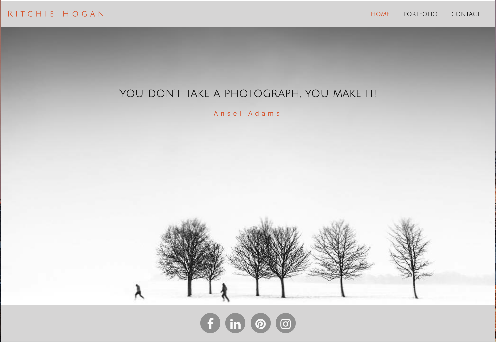
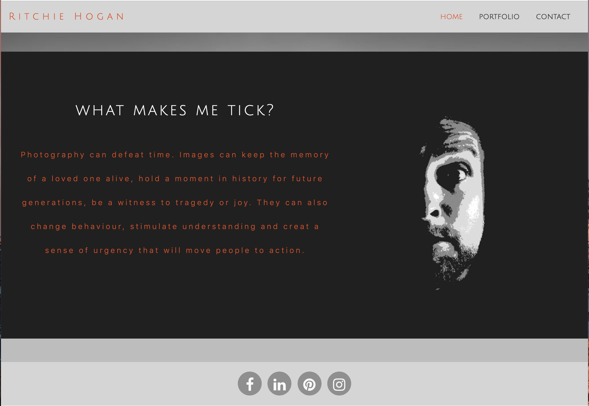
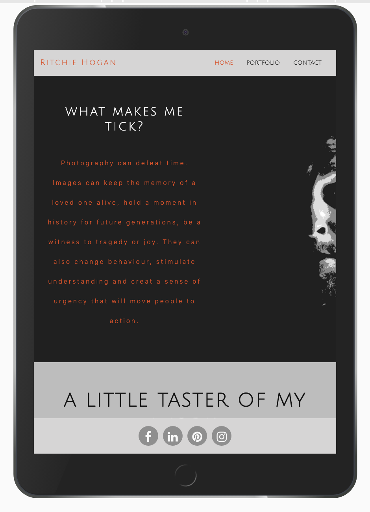
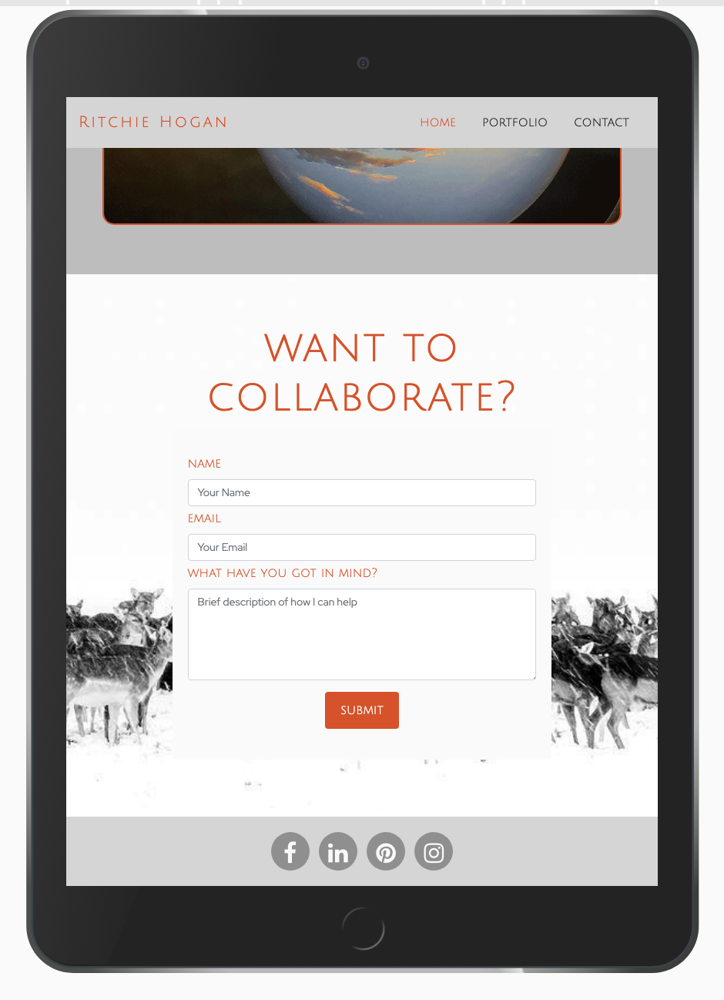
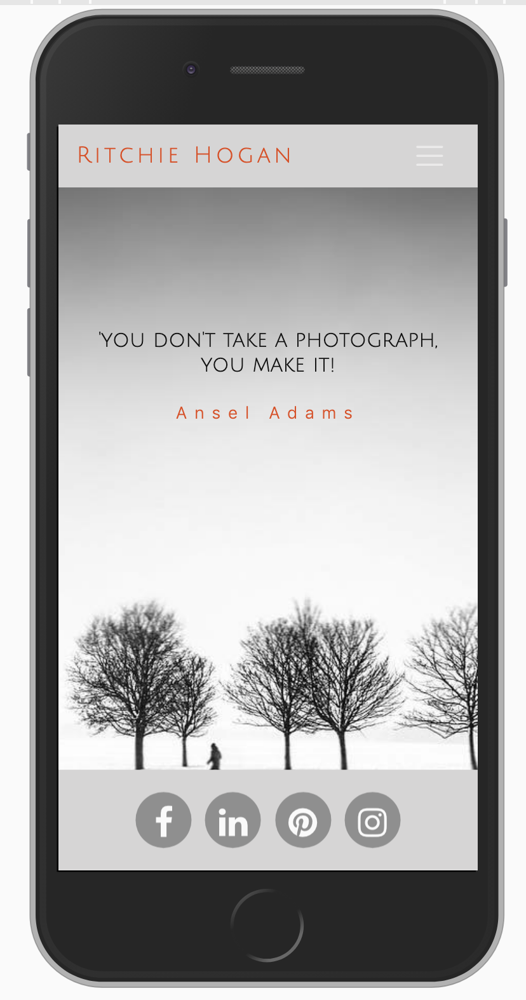
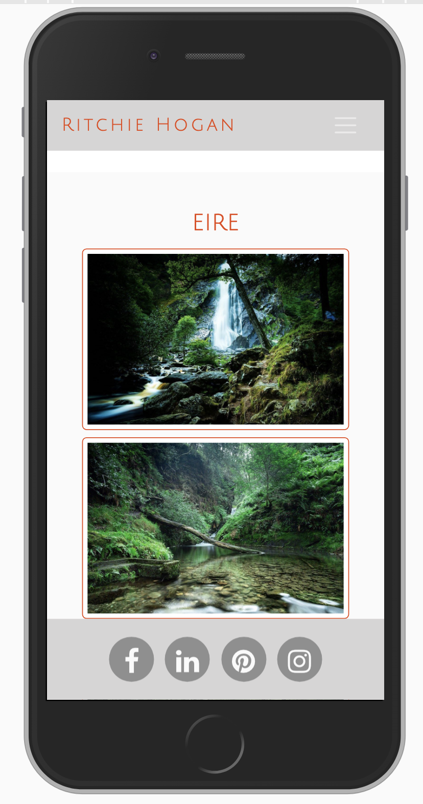
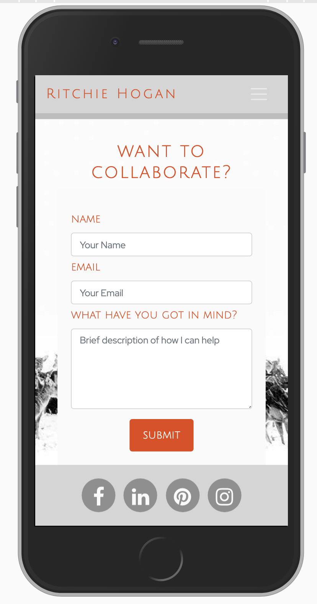

## Elaine Archbold User-Centric Frontend Development Milestone Project

This is a portfolio site for Ritchie Hogan. Ritchie is a friend of mine who is an amateur photographer and has allowed me to use his name and photographs for this project.

## UX
My goal in the design was to display Ritchie’s portfolio of work, along with his contact details should users wish to collaborate with him on a project.

*As a user type, someone interested in working with or purchasing from Ritchie would want to be able to easily access his body of work or to be able to reach out and contact him. For this reason, I created a clean and simple look, with the photos speaking for themselves. It was important that the site is responsive and very user friendly with the images taking centre stage and easy to access. I kept the colour palette simple with shades of grey and added #e84610 for a highlight of colour.

I kept the Navbar and footer simple, and the lightbox on the portfolio page gives an overall gallery view before an image is selected, which is when the lightbox effect kicks in.

## Technologies
1. HTML
2. CSS
3. Bootstrap (4)
4. Photoshop

## Features
The home page features a scrolling parallax effect, with a photo carousel and contact form.

The portfolio page includes a gallery lightbox made from a snippet taken from https://epicbootstrap.com/snippets/lightbox-gallery. The images display in a gallery view until one is selected.

I used the hvr-sweep-to-bottom bootstrap function for the Navbar and used transitions for the buttons and links.

### Features Left to Implement
I would like to add a 'shop' page where people could purchase prints of the images and an 'upcoming events' page when Ritchie begins to display his work in public.

## Testing
I have set all of the footer links to link to the social media site homepages, apart from Instagram. Ritchie’s Instagram page is the only one he is currently active on. All links open in a new tab.

I used Google Developer Tools to check the responsiveness of the site.

All HTML was checked on the W3C Mark-up Validation Service.

The CSS was checked on the W3C CSS Validation Service.

All HTML was formatted on https://freeformatter.com.

Screenshots of the responsive design can be seen here:

[[assets/images/desktop1.jpg\|height=49px]]

## Deployment
This project was written partly in Brackets, and then edited in GitPod before being deployed to GitHub.

### Content
The text in the 'about me' section on the home page was taken from: https://time.com/4839246/photographers-passion/
"Why We Do It: Photographers and Photo Editors on the Passion That Drives Their Work"

### Media
All photos used are those belonging to Ritchie Hogan, and he has given permission to use them for the purpose of this project.
I used Photoshop to create the background image of Parallaxtwo. I used the image adjustments to posterize a photo Ritchie had of himself. This is only visible on larger screens as I used a media query to change the background of this section on mobile devices.

### Acknowledgements
The footer content was taken and amended from the bootstrap resume mini-project with the Code Institute.

The media query for the responsive contact form on the home page was also taken and amended from the boostrap resume mini-project.

The responsive Navbar Javascript function was found on the 'Beyond Bootstrap' section in 'Bootstrapping your next big idea' on the course module with the Code Institute.

I found the scrolling parallax tutorial on: https://www.w3schools.com/howto/howto_css_parallax.asp

I found the photo carousel tutorial on: http://w3schools.com/bootstrap/bootstrap_carousel.asp

I found the lightbox snippet on the Portfolio page on: https://epicbootstrap.com/snippets/lightbox-gallery
