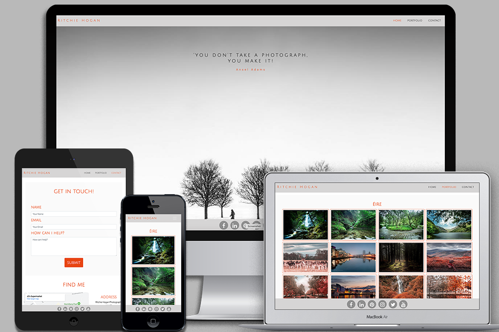

## Elaine Archbold User-Centric Frontend Development Milestone Project

This is a portfolio site for amateur photographer Ritchie Hogan. Ritchie has built up a collection of work over the past couple of years. He currently displays his work through his Instagram feed, but in the future would like to run a website where he would be able to offer prints of his photos for sale.
He is in the process of increasing his follower numbers on Instagram but would like to utilise more social media channels and drive traffic to this website.

## UX
My goal in the design was to display Ritchie’s portfolio of work, along with his contact details should users wish to collaborate with him on a project. I created a clean and simple look, with the photos speaking for themselves. It was important that the site is responsive and very user friendly with the images taking centre stage and easy to access. I kept the colour palette simple with shades of grey and added #e84610 for a highlight of colour.

I kept the Navbar and footer simple, and the lightbox on the portfolio page gives an overall gallery view before an image is selected, which is when the lightbox effect kicks in.

*User A - wants to be able to view Ritchie's portfolio. The Navbar contains a portfolio link which will take the user to the portfolio page where all of the images are available. I have also put a link to the Portfolio page just below the photo carousel on the home page.

*User B - wants to get in touch with Ritchie to discuss a future project. There is a contact form on the home page, as well as a Contact link in the NavBar to take the user to a contact page containing a contact form and contact details for Ritchie.

The site can be viewed through GitHub pages here: https://elainearchbold.github.io/front-end-development-milestone-project/

## Features
### Existing Features
The home page features a scrolling parallax effect, with four sections. Section one is the landing view and is one of Ritchie's images with a photography quote. Section two is a small 'about me' section (see in 'content' below for the text reference), Section three contains a photo carousel displaying a few of Ritchie's images along with a link to the Portfolio page, and finally Section four contains a contact form.

The portfolio page includes a gallery lightbox made from a snippet taken from https://epicbootstrap.com/snippets/lightbox-gallery. The images display in a gallery view until one is selected.

I used the hvr-sweep-to-bottom bootstrap function for the Navbar items and I used transitions for the buttons and footer links.

The contact page contains a contact form, a google maps iframe and a contact details section.

I also created a favicon in Photoshop which can further be used for social media branding.

### Features Left to Implement
I would like to add a 'shop' page where people could purchase prints of the images and an 'upcoming events' page when Ritchie begins to display his work to the public.

## Technologies Used
1. HTML
2. CSS
3. Bootstrap (4)
4. Photoshop

## Testing
I have set all of the footer links to link to the social media site homepages, apart from Instagram. Ritchie’s Instagram page is the only one he is currently active on. All links open in a new tab.

I used Google Developer Tools to check the responsiveness of the site. The Navbar and footer are responsive and reduce on smaller screens. Also, most of the sections have media queries attached to them to allow for better UX on mobile devices.

The site had been tested on Chrome, Firefox and Safari.

I used the GitHub pages link to check the site on my phone, where I discovered some discrepancies between what was shown in developer tools and what was actually showing on the live site. This allowed me to fix these issues to ensure that the live site would look how it should.

All HTML was checked on the W3C Mark-up Validation Service.

The CSS was checked on the W3C CSS Validation Service.

All HTML was formatted on https://freeformatter.com.

All links have been tested.

The forms have been tested and will not submit unless the information is entered in the correct format.

Screenshots of the responsive design can be seen here:

## Deployment
This project was written partly in Brackets, and then edited in GitPod before being deployed to GitHub. I had been using Cloud9 through AWS educate, but following some issues with account credits, I was advised by Student Support to use GitPod.

## Credits
### Content
The text in the 'about me' section on the home page was taken from: https://time.com/4839246/photographers-passion/
"Why We Do It: Photographers and Photo Editors on the Passion That Drives Their Work"

### Media
All photographs used are those belonging to Ritchie Hogan, and he has given permission to use them for the purpose of this project.
I used Photoshop to create the background image for Parallax two. I used the image adjustments to posterize a photo Ritchie had of himself. This is only visible on larger screens as I used a media query to change the background of this section on mobile devices.

### Acknowledgements
The footer content was taken and amended from the bootstrap resume mini-project with the Code Institute.

The media query for the responsive contact form on the home page was also taken and amended from the boostrap resume mini-project.

The responsive Navbar Javascript function was found on the 'Beyond Bootstrap' section in 'Bootstrapping your next big idea' on the course module with the Code Institute.

I found the scrolling parallax tutorial on: https://www.w3schools.com/howto/howto_css_parallax.asp

I found the photo carousel tutorial on: http://w3schools.com/bootstrap/bootstrap_carousel.asp

I found the lightbox snippet on the Portfolio page on: https://epicbootstrap.com/snippets/lightbox-gallery
